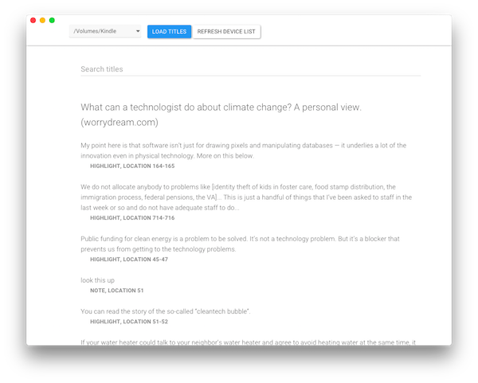

# dickens
The missing notes and highlights manager for Amazon Kindle

## Introduction
Dickens loads notes and highlights from your Amazon Kindle, enabling you to easily save them to your computer. The simple application is more convenient than reading 'My Clippings.txt' yourself or uploading it to a web service. Unlike the Amazon Kindle web application, Dickens loads notes and highlights from content not purchased on the Amazon Store as well.

This application was written with web technologies using the [Electron](http://electron.atom.io/) framework. It has been tested on Mac OS X 10.10.5 (Yosemite) with the 2014 Amazon Wifi Touchscreen Kindle. Binaries are packaged with [Max Ogden's electron-packager](https://github.com/maxogden/electron-packager).

## Usage

To run from source:
- `npm install`
- `npm start`

## License

Copyright (c) 2015-2016 Shubhro Saha. All rights reserved.

Dickens is covered by the MIT license, a permissive free software license that lets you do anything you want with the source code, as long as you provide back attribution and "don't hold [me] liable". For the full license text see the [LICENSE.md](LICENSE.md) file.